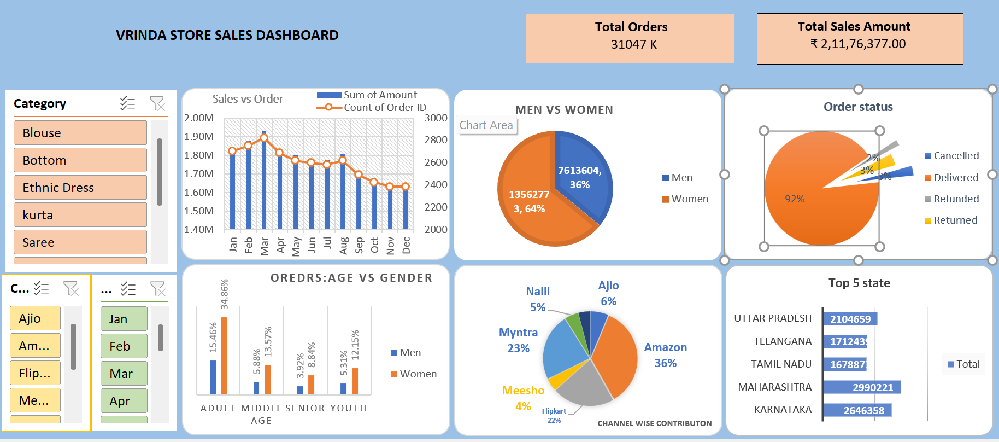

# Vrinda Store Sales Dashboard

## Project Overview

The **Vrinda Store Sales Dashboard** is an interactive data visualization project built using **Microsoft Excel**.

The dashboard provides insights into sales performance, customer demographics, order trends, and channel-wise contributions. It helps understand customer behavior and identify top-performing sales platforms and regions.

---

## Dashboard Preview

---

## Key Insights

### Sales Performance

* Monthly analysis of **sales amount vs number of orders**
* Identifies peak sales months and low-performing periods

### Customer Demographics

* Comparison of **Men vs Women customers**
* Age group analysis (Adult, Middle Age, Senior, Youth)

### Order Status Analysis

Breakdown of orders by status:

* Delivered
* Cancelled
* Refunded
* Returned

### Channel Contribution

Sales contribution from different platforms:

* Amazon
* Flipkart
* Myntra
* Ajio
* Meesho
* Nalli

### Geographic Analysis

Top states contributing to overall sales:

* Uttar Pradesh
* Telangana
* Tamil Nadu
* Maharashtra
* Karnataka

---

## Dashboard Filters

The dashboard includes interactive slicers to filter data by:

* Product Category
* Sales Channel
* Month

---

## Tools Used

* Microsoft Excel
* Pivot Tables
* Pivot Charts
* Slicers
* Data Cleaning

---

## Files in Repository

* `vrinda_store_dashboard.xlsx` – Excel dashboard file
* `vrinda_store_dataset.csv` – Dataset used for analysis
* `dashboard_preview.png` – Dashboard screenshot

---

## Project Purpose

This project demonstrates **data analysis and dashboard creation using Excel**. The goal is to convert raw sales data into meaningful insights that help in better decision-making.

---

## Author

Data Analyst Portfolio Project
